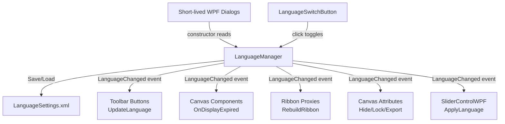

# Technical Design: Bilingual Switch Support (v2 — Optimized)

## Architecture Overview



## Translation Scope (Full Audit)

| Layer | Count | Examples |
|---|---|---|
| GH Components (Name + Desc) | 23 classes × 2 | EventComponent, ZDepth, MotionText, etc. |
| GH Component Input/Output Params | per-component | RegisterInputParams / RegisterOutputParams |
| Toolbar Button Tooltips | 13 buttons | ModifySender, ClickFinder, SliderControl, etc. |
| Canvas-Rendered Text | 5 strings | "Hide", "Lock", "Empty Mode", "Export", "Open" |
| WPF Dialog UI | 6 dialogs | ModifySenderWindow, ScribbleControl, SliderControl, etc. |
| WPF MessageBox Strings | ~30 calls | Error messages, validation prompts |
| ShowTemporaryMessage | ~15 calls | Toast-style status messages |
| Context Menu Items | ~5 items | ToolbarPositionManager: Top/Left/Right/Bottom/OnToolbar |
| GH Component Right-Click Menu | 1 item | EventComponent "Empty Mode" toggle tooltip |

## Key Design Decisions

### D1. Translation Storage — Static Dictionary (Not .resx)

DeepWiki suggested `.resx` satellite assemblies. We reject this for our case because:
- Only 2 languages, not N
- Component count is small (~23)
- .resx adds satellite DLL build complexity to the Grasshopper plugin
- A single static `Dictionary<string, (string EN, string ZH)>` in `LanguageManager.cs` is self-contained, searchable, and debuggable

### D2. WPF Localization — Code-Behind `ApplyLanguage()` (Not DynamicResource)

DeepWiki suggested XAML `{DynamicResource}` bindings. We reject this because:
- Requires refactoring every XAML file to replace hardcoded strings with resource keys
- Adds risk of runtime binding failures
- Our dialogs (except SliderControlWPF) are short-lived — created fresh each time

**Chosen approach**: Each WPF dialog gets an `ApplyLanguage()` method called from its constructor. `SliderControlWPF` additionally subscribes to `LanguageManager.LanguageChanged`.

### D3. Component Name/Description — Override Getters (Not Setter Mutation)

Override `Name` and `Description` property getters to dynamically return the current language's string. This is safe because:
- Grasshopper uses `ComponentGuid` for serialization/identity, not `Name`
- The getter override means every display read automatically returns the right language
- No need to manually iterate and set values on language change

### D4. Canvas-Rendered Custom Text — LanguageManager Lookups in Render

Components with custom `GH_ComponentAttributes` that draw text directly via `Graphics.DrawString()` (e.g., `EventComponentAttributes` draws "Hide"/"Lock"/"Empty Mode", `MotionButtonTemplate` draws "Export"/"Open") will fetch their labels from `LanguageManager.GetString()` at render time. Since `OnDisplayExpired(true)` is called on language change, they automatically repaint with the new strings.

### D5. MessageBox, ShowTemporaryMessage & Port Translation

All UI popups, status toast messages (ShowTemporaryMessage), and component input/output ports must be dynamically translated:
- **MessageBox / Toasts**: All hardcoded messages will be cataloged and looked up via `LanguageManager.GetString()`.
- **Component Ports (Input/Output)**: A generic helper `LanguageManager.LocalizeComponentParams(GH_Component)` will recursively iterate through a component's `Params.Input` and `Params.Output` lists to update their `Name` and `Description` dynamically on language switch, utilizing keys derived from the component's `ComponentGuid` and parameter index.

## Component Details

### 1. `LanguageManager` (`Motion/General/LanguageManager.cs`)

```csharp
public enum Language { ZH, EN }

public static class LanguageManager
{
    public static Language CurrentLanguage { get; set; }
    public static event Action LanguageChanged;
    
    // Hierarchical key convention:
    //   "Component.EventComponent.Name"
    //   "Button.ModifySender.Tooltip"
    //   "Canvas.Hide"
    //   "UI.ModifyWindow.Title"
    static readonly Dictionary<string, (string EN, string ZH)> Translations = ...;
    
    public static string GetString(string key, string fallback)
    {
        if (!Translations.TryGetValue(key, out var pair)) return fallback;
        return CurrentLanguage == Language.EN ? pair.EN : pair.ZH;
    }
    
    // Auto-detect system culture on first run
    static void DetectSystemLanguage() { ... }
    
    // Persist to / load from LanguageSettings.xml
    static void Save() { ... }
    static void Load() { ... }
    
    // Orchestrate full UI refresh
    public static void UpdateAllUI()
    {
        // 1. Toolbar buttons: iterate Tag-stored controllers, call UpdateLanguage()
        // 2. Canvas components: OnDisplayExpired(true) on Motion namespace objects
        // 3. Ribbon: update ObjectProxies + RebuildRibbon()
        // 4. Fire LanguageChanged for SliderControlWPF subscribers
    }
}
```

### 2. `LanguageSwitchButton` (`Motion/Button/LanguageSwitchButton.cs`)

- Inherits `MotionToolbarButton`
- Draws a dynamic 24×24 icon with GDI+: "中" or "EN" text inside a rounded rect
- Left-click toggles `LanguageManager.CurrentLanguage` and calls `UpdateAllUI()`
- Subscribes to `LanguageChanged` to refresh its own icon

### 3. Toolbar Button Base (`MotionToolbarButton.cs`)

Add:
```csharp
protected ToolStripItem MyButton { get; set; }
public virtual void UpdateLanguage() { }
```

Modify `AddButtonToToolbars()` to store the reference before calling `MotionToolbarManager.AddButtonToToolbars()`.

### 4. Canvas Attribute Text Localization

**`EventComponentAttributes.cs`**:
- Replace `"Hide"` → `LanguageManager.GetString("Canvas.Hide", "Hide")`
- Replace `"Lock"` → `LanguageManager.GetString("Canvas.Lock", "Lock")`
- Replace `EmptyModeText` field → `LanguageManager.GetString("Canvas.EmptyMode", "Empty Mode")`

**`MotionButtonTemplate.cs`**:
- `Button1Text` and `Button2Text` are set at construction time by `ExportSliderAnimation`. Override `UpdateLanguage()` pattern or fetch from LanguageManager in `Render()`.

### 5. WPF Dialog Localization Pattern

Each dialog gets an `ApplyLanguage()` method:
```csharp
private void ApplyLanguage()
{
    Title = LanguageManager.GetString("UI.ModifyWindow.Title", "Modify Sender");
    // GroupBox headers, Button contents, TextBlock texts, CheckBox contents, ToolTips
}
```

Called from constructor after `InitializeComponent()`. For `SliderControlWPF`, also subscribe:
```csharp
LanguageManager.LanguageChanged += ApplyLanguage;
this.Closed += (s, e) => LanguageManager.LanguageChanged -= ApplyLanguage;
```

### 6. Ribbon Proxy Update

```csharp
foreach (var proxy in Instances.ComponentServer.ObjectProxies)
{
    if (proxy.LibraryGuid == MotionInfo.Id)
    {
        proxy.Desc.Name = LanguageManager.GetString(
            "Component." + proxy.Desc.Name + ".Name", proxy.Desc.Name);
        proxy.Desc.Description = LanguageManager.GetString(
            "Component." + proxy.Desc.Name + ".Desc", proxy.Desc.Description);
    }
}
Instances.DocumentEditor?.RebuildRibbon();
```

### 7. Context Menu Localization (ToolbarPositionManagerButton)

The 5 position menu items ("Top", "Left", "Right", "Bottom", "On Toolbar") are recreated or updated via `UpdateLanguage()` override.
