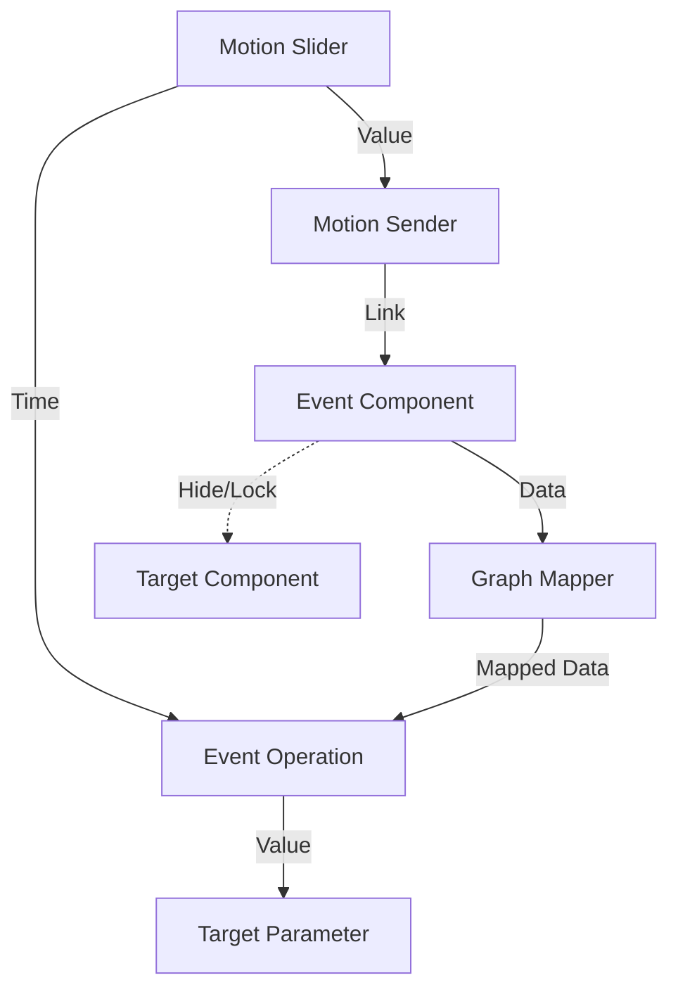

# Motion 🚀

`Motion` 是一个专为 Grasshopper (GH) 设计的动画插件，参考了多种优秀的动画工具及核心思路，旨在为用户提供流畅、直观的 GH 动画制作体验。

---

## 🏗️ 核心架构 (Architecture)

Motion 采用**单控制器**架构，通过唯一的 `Motion Slider` 驱动整个动画系统。

---

## 🧩 组件详解 (Component Details)

### 01_Animation

#### Motion Slider (核心控制器)
全局唯一的时间轴控制器。每个文档仅允许放置一个。
*   **智能连接**: 放置时会自动寻找并连接所有 `EventOperation` 的 `Time` 输入端。
*   **双击交互**: 双击文本框可直接输入 `min-max` (如 "0-100") 快速修改区间。
*   **秒数显示**: 在左侧实时显示当前帧对应的时间（如 "0.0s-5.0s"），受 FPS 设置影响。
*   **自动同步**: 当连接的 `Motion Sender` 区间超出当前范围时，Slider 会自动扩展以包含所有 Sender。

#### Motion Sender (信号发射器)
用于将时间信号分发给各个 Event。
*   **就近连接**: 创建时会自动寻找距离最近的 `Motion Slider` 并连接。
*   **快速定义**: 通过修改 `NickName` (如 "0-30") 定义该 Sender 的有效区间。
*   **快速跳转**: 右键菜单包含 **"跳转到 Event"** 列表，按 Group 分组显示，点击可快速定位到对应的 Event 组件。

#### Event (事件)
*   **控制逻辑**:
    *   **HIDE**: 在事件时间范围外隐藏组件。
    *   **LOCK**: 在事件时间范围外锁定组件。
*   **可视化**: 鼠标悬停会自动绘制指示线，指向受控组件。
*   **双击跳转**: 双击组件主体可跳转至对应的 `EventOperation`。

#### EventOperation (核心处理器)
处理多个 Event 的状态并输出控制值。
*   **动态参数 (ZUI)**: 放大组件点击 `+` 号可添加以下输出端：
    *   `Index`: 当前生效事件的序号。
    *   `Value Domain`: 当前事件的值域。
    *   `Time Domain`: 当前事件的时间区间。
*   **状态反馈**: 组件下方实时显示当前状态（如 `OUTSIDE` 或当前时间区间）及所属 Group 名称。
*   **组名同步**: 右键菜单支持 **"命名当前组名称为 Event 名称"**，方便批量管理组名。
*   **Interval Lock**: 指定区间并将组件编组，时间在区间外时锁定组内所有组件。

### 02_Export

#### ExportSliderAnimation
*   **导出**: 支持 `.png` 格式透明背景导出。
*   **渲染**: 支持 `Raytraced` 模式及采样数设置。
*   **控制**: 自定义导出区间，点击 `Open` 跳转文件夹，按 ESC 停止导出。

### 03_Utils

#### 辅助工具
*   **AdjustSearchCount**: 调整组件最大搜索数量 (Max 30)。
*   **FilletEdgeIndex**: 配合 `FilletEdge` 根据点确定边序号。
*   **ZDepth**: 开启深度图显示模式 (类似 `ShowZBuffer`) 并支持自定义比例导出。
*   **Arrange Tab Components**: 将指定插件 Tab 的所有电池分组列出。
*   **Dynamic Output**: 自动根据输入数据结构 (List/Tree) 生成对应数量的输出端。
*   **Color Alpha**: 修改颜色的 Alpha 值。

#### 视觉与材质
*   **Motion Text**: 设置文字属性、字间距、多色渐变，输出 Mesh 和边缘线。
*   **Motion Image Preview**: 预览材质。
*   **Motion Material**: 支持 Diffuse, Transparency, Environment, Bump 贴图 (路径或 Bitmap 对象)。
*   **Motion Image Selector**: 读取文件夹图片，根据 Index 输出。
*   **Image Transform Settings**: 修改贴图的 Transform 属性。
*   **Point On View**: 配合 Human 插件渲染物体到屏幕，提供视窗预览和导出坐标。

---

## 🛠️ 工具栏按钮 (Toolbar)

| 按钮 | 功能描述 |
| :--- | :--- |
| **ModifySliderButton** | **批量创建/修改 Slider** • 输入 "0,30,60" 创建三个 Slider。 • 支持分割、合并、替换 Slider 区间值。 |
| **SliderControlButton** | **控制 Slider** • 双向更新数值，支持输入回车。 • 右键点击 +/- 可连续增减，MIN/MAX 跳转极值。 |
| **UpdateSenderButton** | 为所有 `Motion Slider` 自动连接对应区间的 `Motion Sender`。 |
| **ConnectToMultiple...** | **智能连接** • 选中多个 `Graph Mapper` 自动连接/创建 `Event Operation`。 • 智能归组 (GH_Group) 管理。 |
| **ClickFinderButton** | **组件查找** • 左键闪烁显示所有 GH 物件的 BoundingBox。 • 点击 Rhino 视窗内物件跳转至 GH 画布位置。 |
| **AddScribbleWPFButton** | **增强版 Scribble** • 突破字体大小限制，支持 5 种字体，自动换行预览。 |
| **RangeSelectorWPFButton** | **区间选择** • 提取选中项的最小值和最大值创建区间 Param。 |
| **NamedViewSwitchButton** | **视窗切换** • 开启后使用 `CTRL + +/-` 循环切换 Named View。 |
| **JumpToAffected...** | **双向跳转** • 点选 `Event` 跳转至受控组件。 • 点选组件跳转至控制它的 `Event`。 |
| **MotionSliderSettings...** | **时间显示** • 在 `Motion Slider` 左侧显示基于帧数的时间，右键可修改 FPS。 |

---

## 🚀 快速开始 (Quick Start)

1.  **下载**: 获取最新版本的 `.gha` 文件。
2.  **安装**:
    *   在 Grasshopper 中点击 `File` -> `Special Folders` -> `Components Folder`。
    *   将 `.gha` 文件复制到该文件夹中。
    *   **解锁**: 右键点击文件 -> 属性 -> 勾选 `Unblock` (解锁) -> 确定。
3.  **重启**: 重启 Rhino 和 Grasshopper 以加载插件。
4.  **开始使用**:
    *   放置一个 `Motion Slider`。
    *   连接 `Motion Sender` 并设置时间区间。
    *   创建 `Event` 控制组件显隐。
    *   连接 `Event Operation` 驱动动画参数。

---

## 🤝 参与贡献

欢迎提交 Issue 或 Pull Request 来改进插件。

