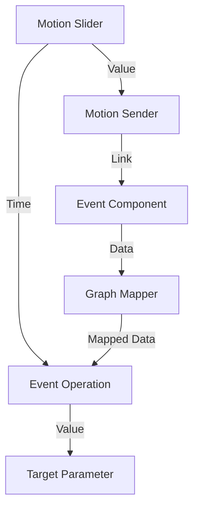

[English](./README.md) | [中文](./README_zh.md)

# Motion 🚀

`Motion` is an animation plugin designed specially for Grasshopper (GH). Inspired by various excellent animation tools and core concepts, it aims to provide users with a smooth and intuitive GH animation creation experience.

## 📺 Tutorials

*   [Motion Plugin Demo 1 (Bilibili)](https://www.bilibili.com/video/BV1nMXWYgEBi)
*   [Motion Plugin Demo 2 (Bilibili)](https://www.bilibili.com/video/BV1eBRvYKE6E)

---

## 🏗️ Architecture

Motion adopts a **Single Controller** architecture, driving the entire animation system through a unique `Motion Slider`.

---

## 🧩 Component Details

### 01_Animation

#### Motion Slider (Core Controller)
The unique timeline controller globally. Only one is allowed per document.
*   **Smart Connection**: Automatically finds and connects to the `Time` input of all `EventOperation` components when placed.
*   **Double-click Interaction**: Double-click the text box to directly input `min-max` (e.g., "0-100") to quickly modify the range.
*   **Seconds Display**: Real-time display of the time corresponding to the current frame on the left side (e.g., "0.0s-5.0s"), affected by FPS settings.
*   **Auto Sync**: When the range of a connected `Motion Sender` exceeds the current range, the Slider automatically expands to include all Senders.

#### Motion Sender (Signal Transmitter)
Used to distribute time signals to various Events.
*   **Proximity Connection**: Automatically finds and connects to the nearest `Motion Slider` upon creation.
*   **Quick Definition**: Define the effective range of the Sender by modifying `NickName` (e.g., "0-30").
*   **Quick Jump**: The context menu includes a **"Jump to Event"** list, grouped by Group, allowing quick positioning to the corresponding Event component by clicking.

#### Event
*   **Control Logic**:
    *   **HIDE**: Hide components outside the event time range.
    *   **LOCK**: Lock components outside the event time range.
*   **Visualization**: Hovering automatically draws a guide line pointing to the controlled component.
*   **Double-click Jump**: Double-click the component body to jump to the corresponding `EventOperation`.

#### EventOperation (Core Processor)
Processes the status of multiple Events and outputs control values.
*   **Dynamic Parameters (ZUI)**: Zoom in on the component and click the `+` sign to add the following outputs:
    *   `Index`: The index of the currently active event.
    *   `Value Domain`: The value domain of the current event.
    *   `Time Domain`: The time interval of the current event.
*   **Status Feedback**: Real-time display of the current status (e.g., `OUTSIDE` or current time interval) and the belonging Group name below the component.
*   **Group Name Sync**: The context menu supports **"Name Current Group as Event Name"** for convenient batch management of group names.
*   **Interval Lock**: Specify an interval and group components; locks all components in the group when time is outside the interval.

### 02_Export

#### ExportSliderAnimation
*   **Export**: Supports `.png` format transparency background export.
*   **Render**: Supports `Raytraced` mode and sample count settings.
*   **Control**: Customize export range, click `Open` to jump to the folder, press ESC to stop export.

### 03_Utils

#### Auxiliary Tools
*   **AdjustSearchCount**: Adjust component maximum search count (Max 30).
*   **FilletEdgeIndex**: Determine edge index based on point, used with `FilletEdge`.
*   **ZDepth**: Enable depth map display mode (similar to `ShowZBuffer`) and support custom scale export.
*   **Arrange Tab Components**: Group and list all components of a specified plugin Tab.
*   **Dynamic Output**: Automatically generate corresponding number of output terminals based on input data structure (List/Tree).
*   **Color Alpha**: Modify the Alpha value of a color.

#### Visuals & Materials
*   **Motion Text**: Set text attributes, letter spacing, multi-color gradients, output Mesh and boundary lines.
*   **Motion Image Preview**: Preview materials.
*   **Motion Material**: Support Diffuse, Transparency, Environment, Bump maps (paths or Bitmap objects).
*   **Motion Image Selector**: Read folder images and output based on Index.
*   **Image Transform Settings**: Modify texture Transform attributes.
*   **Point On View**: Render objects to screen with Human plugin, providing viewport preview and coordinate export.

---

## 🛠️ Toolbar Buttons

| Button | Description |
| :--- | :--- |
| **ModifySliderButton** | **Batch Create/Modify Slider** • Input "0,30,60" to create three Sliders. • Supports splitting, merging, and replacing Slider range values. |
| **SliderControlButton** | **Control Slider** • Two-way value update, supports Enter key input. • Right-click +/- for continuous increase/decrease, MIN/MAX to jump to extremes. |
| **UpdateSenderButton** | Automatically connect `Motion Sender` of corresponding range for all `Motion Slider`s. |
| **ConnectToMultipleButton** | **Smart Connection** • Select multiple `Graph Mapper`s to automatically connect/create `Event Operation`. • Smart grouping (GH_Group) management. |
| **ClickFinderButton** | **Component Finder** • Left-click to flash BoundingBox of all GH objects. • Click objects in Rhino viewport to jump to GH canvas position. |
| **AddScribbleWPFButton** | **Enhanced Scribble** • Breaks font size limit, supports 5 fonts, auto-wrap preview. |
| **RangeSelectorWPFButton** | **Range Selection** • Extract min and max values of selected items to create Param interval. |
| **NamedViewSwitchButton** | **Viewport Switch** • Enable to cycle switch Named View using `CTRL + +/-`. |
| **JumpToAffectedButton** | **Bi-directional Jump** • Click `Event` to jump to controlled component. • Click component to jump to its controlling `Event`. |
| **MotionSliderSettingsButton** | **Time Display** • Display frame-based time on the left of `Motion Slider`, right-click to modify FPS. |

---

## 🚀 Quick Start

1.  **Download**: Get the latest version of the `.gha` file.
2.  **Install**:
    *   In Grasshopper, click `File` -> `Special Folders` -> `Components Folder`.
    *   Copy the `.gha` file to this folder.
    *   **Unblock**: Right-click the file -> Properties -> Check `Unblock` -> OK.
3.  **Restart**: Restart Rhino and Grasshopper to load the plugin.
4.  **Start Using**:
    *   Place a `Motion Slider`.
    *   Connect `Motion Sender` and use `ModifySliderButton` to set time intervals, quickly creating multiple `Motion Sender`s.
    *   Double-click `Sender` to create `Event` to control component visibility/hiding.
    *   Use `ConnectToMultipleButton` to quickly create and connect to an `Event Operation` to drive animation parameters.

---

## 🤝 Extra Notes

This plugin has no future maintenance plans and is for reference only.
